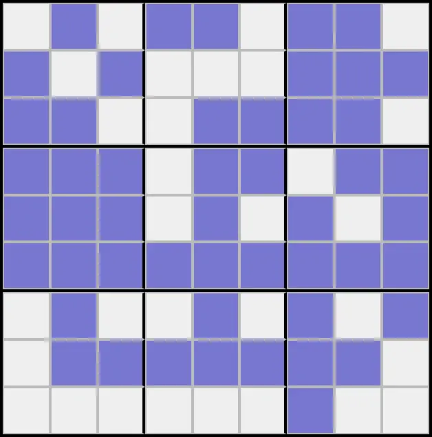
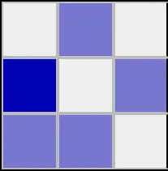
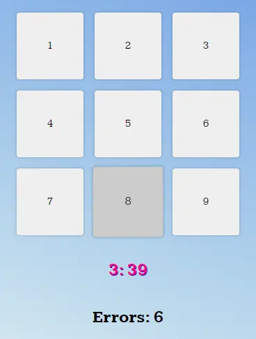
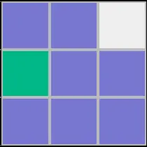
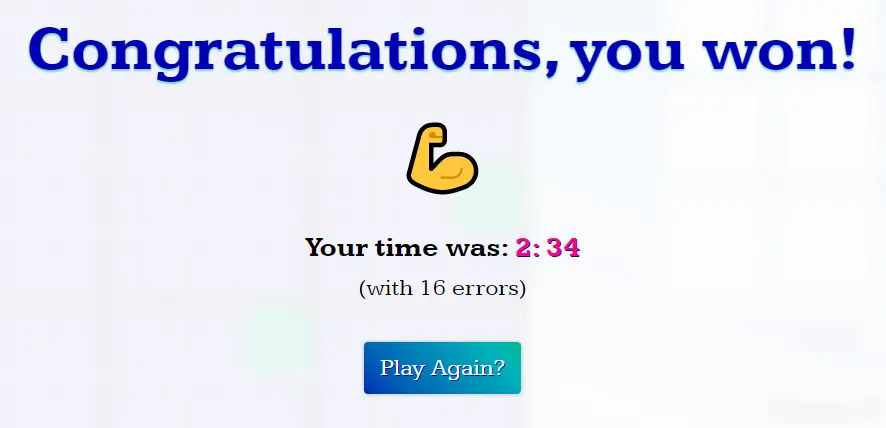

# Soundoku

🤔 Have you ever wondered about what the classic game of Sudoku would be like if you had no visual reference to guide your course of action?

Well, you're in luck! That question is exactly the one the Soundoku answers by providing a unique and challenging audio-oriented puzzle! 🎶

- ⚠️ Warning: This game requires **volume output** to be properly enjoyed. Without it your experience will be very confusing and disappointing.

## Getting Started

 

▶️ Upon opening Soundoku you will be prompted with a fresh, incomplete grid of cells to fill in. This one's probably a little different from what your average Sudoku fan is used to though, since it has no numbers shown on any of the cells!

_So... how are you supposed to figure out what a cell's value is?_

🖱️ Clicking on a _filled cell_ will trigger one of 9 unique tones that each correspond to a number from 1-9. You can tell that a cell has been selected when its background shift to a dark blue shade.

🤓 Logically the challenge is the same: knowing that a row, column, and local box may only contain one of each value (or tone), you can assess which ones are known to be contained in order to determine which ones are not. (and then fill them in to win!)

🔊 You can also listen to any of the 9 tones by clicking the _selection buttons_ that can be found next to your current elapsed time and error count.

- Just don't click one of these buttons when you have an empty cell selected, or else you may errantly make a guess and increment your error count! 😰

✔️ Assigning a cell's correct value with result in the cell turning a mild shade of green, indicating that your analysis (or guessing 😅) was successful.

🎉🎉 When you have correctly filled in every cell you be rewarded with a congratulatory pop-up message containing your total error count for the round.

- You can stash that information and show it to your friends later, who will be awestruck at how cool you are for beating this game! 😏

